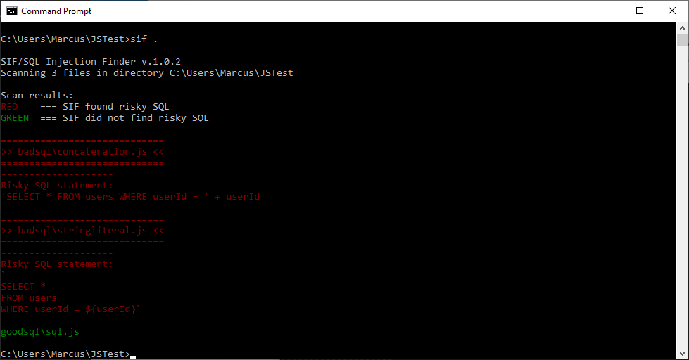

# SIF / SQL Injection Finder

Scan your JavaScript code for potential SQL injection vectors



## Install
npm i -g @marcusfernstrom/sif

## Use
From commandline/terminal run `sif <directory>` where directory is the root of your project.

If a file has a potential SQL injection vector it shows up in red.

SIF will exit with error code 1 if it found any risky SQL, useful if you want to add it to a build script.

## How
SIF grabs all .js files in the directory (recursively) and scans them for MySQL queries `.query(`, when it finds them it collects the SQL statement and analyzes it for string concatenation as well as string literals.

## Notes
SIF does not follow variables. A fairly common pattern is to use constants for SQL statements, such as

```
connection.query(SQL_GET_ALL_USERS, function (error, results, fields) {
  if (error) throw error;
  console.log('The solution is: ', results[0].solution);
});

const SQL_GET_ALL_USERS = `
...sql here
`;
```

Following variables like this is planned for a future version.

This is an early version, please report false positives and false negatives along with the SQL when possible so I can improve the accuracy.